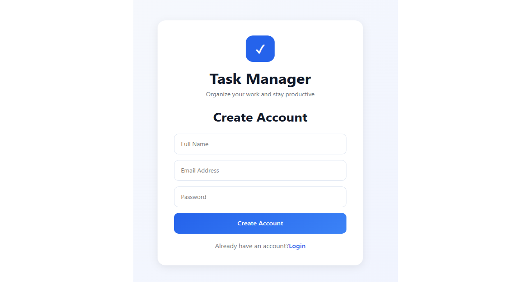
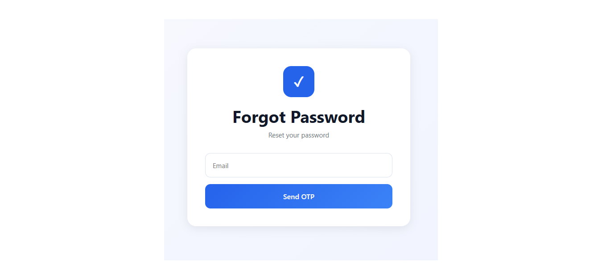
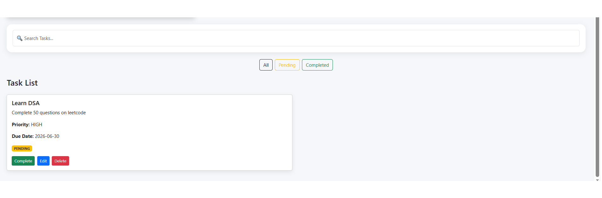

# 📝 Task Manager - Full Stack Web Application

A secure full-stack Task Manager application built using **Spring Boot**, **React.js**, **MySQL**, and **JWT Authentication**.

The application allows users to securely manage their personal tasks with login authentication, email OTP verification, and profile management.

---

## 🚀 Features

### Authentication
- User Registration
- User Login
- JWT Authentication
- Secure Password Encryption (BCrypt)
- Forgot Password using Email OTP
- Reset Password
- Change Password

### Task Management
- Create Task
- Update Task
- Delete Task
- Mark Task as Completed
- Search Tasks
- Filter Tasks
  - All
  - Pending
  - Completed

### User Features
- Update Profile
- User-specific Tasks
- Welcome message after Login

### Security
- Spring Security
- JWT Token Authentication
- Password Encryption
- Protected APIs
- CORS Configuration

---

# 🛠 Tech Stack

## Frontend
- React.js
- Vite
- Axios
- CSS

## Backend
- Java
- Spring Boot
- Spring Security
- Spring Data JPA
- JWT

## Database

- MySQL

## Email Service

- Gmail SMTP

---

# 📂 Project Structure

```
Todo-Task-Manager
│
├── todo-backend
│
└── todo-frontend
```

---

# ⚙️ Installation

## Prerequisites

Make sure the following software is installed:

- Java 21 or later
- Maven
- Node.js (v18+ recommended)
- MySQL Server
- Git

---

## 1. Clone the Repository

```bash
git clone https://github.com/sanskrutigodase2006/task-manager-fullstack.git
cd task-manager-fullstack
```

---

## 2. Configure the Database

Create a MySQL database:

```sql
CREATE DATABASE todo_manager;
```

Set the following environment variables:

```
DB_PASSWORD=your_mysql_password
MAIL_PASSWORD=your_gmail_app_password
```

---

## 3. Start the Backend

```bash
cd todo-backend
mvn spring-boot:run
```

The backend will run on:

```
http://localhost:8080
```

---

## 4. Start the Frontend

Open another terminal.

```bash
cd todo-frontend
npm install
npm run dev
```

The frontend will run on:

```
http://localhost:5173
```

---

## 5. Open the Application

Visit:

```
http://localhost:5173
```

Register a new account and start managing your tasks.

---

# 📷 Screenshots

## Home Page


---

## Login Page


---

## Register



---

## Forgot Password



---

## Profile Page


---

## Task List



---

# 🔒 Security Features

- JWT Authentication
- BCrypt Password Encryption
- Email OTP Verification
- Protected REST APIs
- User-specific Data Access

---

# ✨ Future Enhancements

- Task Categories
- Dark Mode
- Email Notifications
- Dashboard Analytics
- File Attachments
- Calendar View
- Docker Deployment

---

# 👩‍💻 Developed By

**Sanskruti Godase**

B.Sc Computer Science

Java Full Stack Developer

GitHub:
https://github.com/sanskrutigodase2006

---

## ⭐ If you like this project, don't forget to Star the repository.
